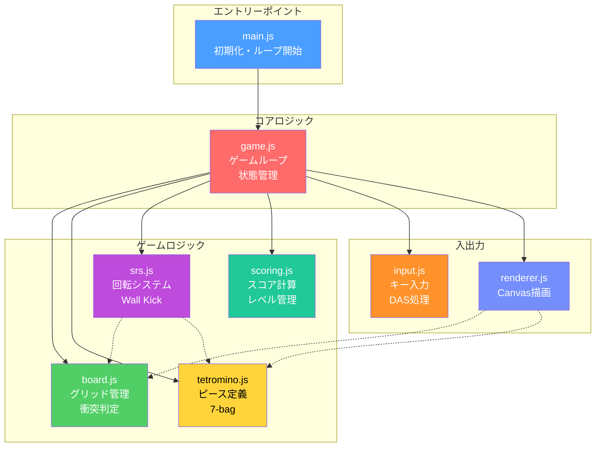
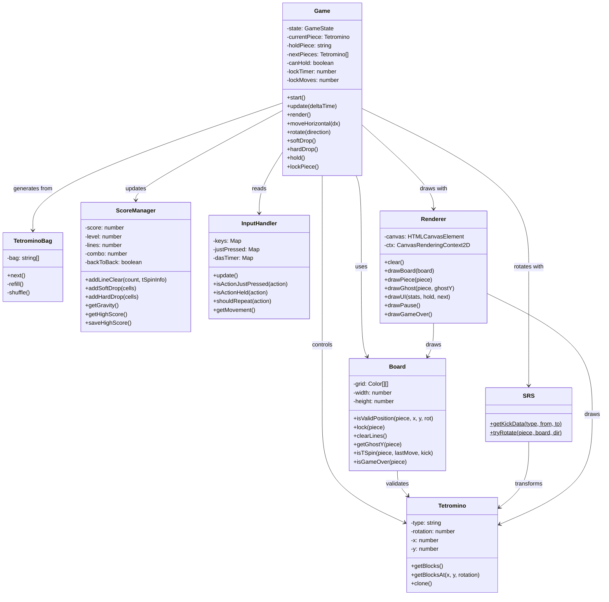
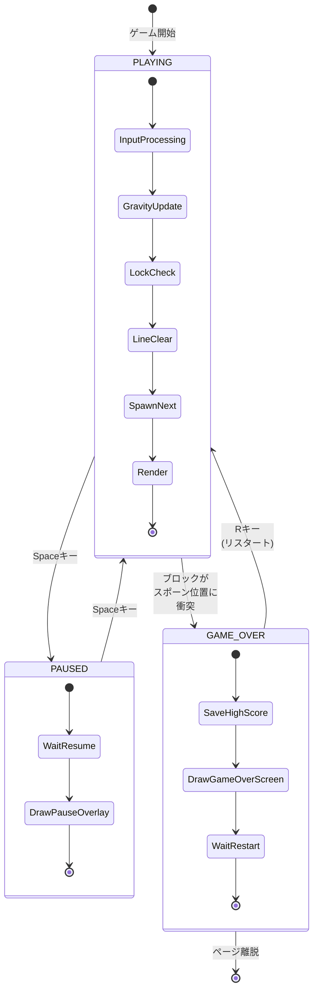

# アーキテクチャ
{: .no_toc }

モジュール構成、クラス設計、ゲーム状態の遷移を図解で解説します。
{: .fs-6 .fw-300 }

## 目次
{: .no_toc .text-delta }

1. TOC
{:toc}

---

## モジュール依存関係

システムは7つのモジュールで構成され、各モジュールが明確な責務を持っています。



### モジュール一覧

| モジュール | ファイル | 行数 | 主な責務 |
|:-----------|:---------|-----:|:---------|
| **Entry** | `main.js` | 19 | Canvas取得、Game初期化、ループ開始 |
| **Game** | `game.js` | 376 | ゲームループ、状態管理、ピース制御 |
| **Board** | `board.js` | 171 | グリッド管理、衝突判定、ライン消去 |
| **Tetromino** | `tetromino.js` | 172 | ピース定義、7-bag Randomizer |
| **SRS** | `srs.js` | 67 | 回転システム、Wall Kickデータ |
| **Input** | `input.js` | 145 | キー入力、DAS/ARR処理 |
| **Renderer** | `renderer.js` | 200+ | Canvas描画、UI表示 |
| **Scoring** | `scoring.js` | 182 | スコア、レベル、重力計算 |

---

## クラス構造

各モジュールの主要クラスとその関係を示します。



### 責務の分離

| レイヤー | クラス | 責務 |
|:---------|:-------|:-----|
| **Controller** | Game | ゲームフロー制御、イベント処理 |
| **Model** | Board, Tetromino, ScoreManager | データ管理、ビジネスロジック |
| **View** | Renderer | 描画処理、UI表示 |
| **Input** | InputHandler | ユーザー入力の抽象化 |
| **Utility** | SRS, TetrominoBag | 専門アルゴリズム |

---

## ゲーム状態遷移

ゲームは3つの状態を持ち、ユーザー入力により遷移します。



### 状態詳細

#### PLAYING状態
{: .text-green-300 }

| フェーズ | 処理内容 |
|:---------|:---------|
| InputProcessing | キー入力の読み取り、移動・回転の実行 |
| GravityUpdate | 落下タイマー更新、自動落下の適用 |
| LockCheck | 着地判定、ロックダウンタイマー管理 |
| LineClear | 完成ラインの消去、スコア計算 |
| SpawnNext | 次のピースのスポーン、ゲームオーバー判定 |
| Render | 画面描画 |

#### PAUSED状態
{: .text-yellow-300 }

- ゲームロジックの更新を停止
- 現在の画面上にポーズオーバーレイを表示
- Spaceキーで再開

#### GAME_OVER状態
{: .text-red-300 }

- ハイスコアをLocalStorageに保存
- 最終スコアとハイスコアを表示
- Rキーでゲームをリスタート

---

## データフロー

```
┌──────────────────────────────────────────────────────────────┐
│                        Game Loop                             │
├──────────────────────────────────────────────────────────────┤
│                                                              │
│  ┌─────────┐    ┌─────────┐    ┌─────────┐    ┌─────────┐  │
│  │  Input  │───▶│  Game   │───▶│  Board  │───▶│Renderer │  │
│  │ Handler │    │ (Logic) │    │ (State) │    │ (View)  │  │
│  └─────────┘    └────┬────┘    └─────────┘    └─────────┘  │
│                      │                                       │
│                      ▼                                       │
│               ┌─────────────┐                               │
│               │   Scoring   │                               │
│               │   Manager   │                               │
│               └─────────────┘                               │
│                      │                                       │
│                      ▼                                       │
│               ┌─────────────┐                               │
│               │LocalStorage │                               │
│               │ (HighScore) │                               │
│               └─────────────┘                               │
│                                                              │
└──────────────────────────────────────────────────────────────┘
```

---

## 次のページ

- [ゲームメカニクス]({{ site.baseurl }}/mechanics) - ゲームループとロックダウンの詳細
- [スコアシステム]({{ site.baseurl }}/scoring) - スコア計算とT-Spin判定
