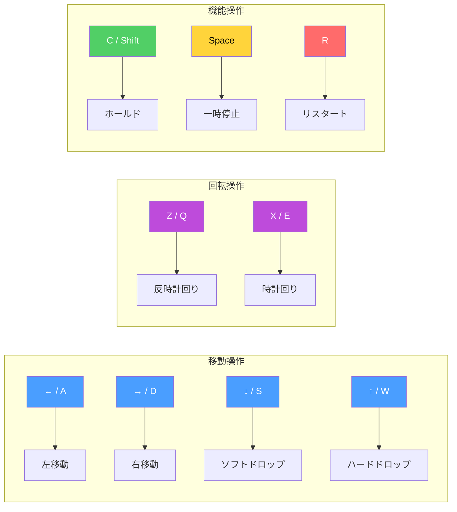

# 操作方法
{: .no_toc }

キーボード操作、DAS（Delayed Auto Shift）、ARR（Auto Repeat Rate）の仕組みを解説します。
{: .fs-6 .fw-300 }

## 目次
{: .no_toc .text-delta }

1. TOC
{:toc}

---

## キーマッピング



---

## 操作一覧

### 移動

| キー | 代替キー | アクション | 説明 |
|:-----|:---------|:-----------|:-----|
| <kbd>←</kbd> | <kbd>A</kbd> | 左移動 | ピースを1セル左に移動 |
| <kbd>→</kbd> | <kbd>D</kbd> | 右移動 | ピースを1セル右に移動 |
| <kbd>↓</kbd> | <kbd>S</kbd> | ソフトドロップ | ピースを高速で落下（長押しで連続） |
| <kbd>↑</kbd> | <kbd>W</kbd> | ハードドロップ | ピースを即座に着地・ロック |

### 回転

| キー | 代替キー | アクション | 説明 |
|:-----|:---------|:-----------|:-----|
| <kbd>Z</kbd> | <kbd>Q</kbd> | 反時計回り | ピースを左に90度回転 |
| <kbd>X</kbd> | <kbd>E</kbd> | 時計回り | ピースを右に90度回転 |

### 機能

| キー | 代替キー | アクション | 説明 |
|:-----|:---------|:-----------|:-----|
| <kbd>C</kbd> | <kbd>Shift</kbd> | ホールド | 現在のピースを保留エリアに移動 |
| <kbd>Space</kbd> | - | 一時停止 | ゲームをポーズ/再開 |
| <kbd>R</kbd> | - | リスタート | ゲームを最初からやり直し |

---

## DAS（Delayed Auto Shift）

キーを長押しした際の自動リピート機能です。

### DASパラメータ

| パラメータ | 値 | 説明 |
|:-----------|:---|:-----|
| **DAS** (初期遅延) | 170ms | 長押し開始から自動リピートまでの時間 |
| **ARR** (リピート速度) | 50ms | 自動リピートの間隔 |

### DAS動作フロー

```
キー押下開始
    │
    ├─ 即座に1回移動
    │
    ▼
┌───────────────┐
│  170ms 待機   │  ← DAS（初期遅延）
│  (何も起きない) │
└───────────────┘
    │
    ▼
┌───────────────┐
│   1回移動     │  ← 自動リピート開始
└───────────────┘
    │
    ▼
┌───────────────┐
│  50ms 待機    │  ← ARR（リピート間隔）
└───────────────┘
    │
    ▼
┌───────────────┐
│   1回移動     │
└───────────────┘
    │
    ▼
  (50ms → 移動 → 50ms → 移動... 繰り返し)
```

### タイムライン例

```
時間(ms):  0    50   100   170   220   270   320   370
           │    │    │     │     │     │     │     │
操作:      ↓    ─    ─     ↓     ─     ↓     ─     ↓
           押下  待機  待機  移動   待機  移動   待機  移動
                            ↑
                          DAS経過
                          (リピート開始)
```

---

## 入力処理の実装

### キー状態管理

```javascript
// キーバインド定義
const KEY_BINDINGS = {
    'ArrowLeft': 'left',
    'KeyA': 'left',
    'ArrowRight': 'right',
    'KeyD': 'right',
    'ArrowDown': 'softDrop',
    'KeyS': 'softDrop',
    'ArrowUp': 'hardDrop',
    'KeyW': 'hardDrop',
    'KeyZ': 'rotateCCW',
    'KeyQ': 'rotateCCW',
    'KeyX': 'rotateCW',
    'KeyE': 'rotateCW',
    'KeyC': 'hold',
    'ShiftLeft': 'hold',
    'ShiftRight': 'hold',
    'Space': 'pause',
    'KeyR': 'restart'
};
```

### 入力判定メソッド

| メソッド | 用途 | 説明 |
|:---------|:-----|:-----|
| `isActionJustPressed(action)` | 単発入力 | キーが今フレームで押された |
| `isActionHeld(action)` | 継続入力 | キーが押されている状態 |
| `shouldActionRepeat(action)` | DAS | 自動リピートが発生すべきか |
| `getMovement()` | 移動取得 | 現在の移動方向 (-1/0/1) |

---

## ホールド機能

現在のピースを保留し、後で使用できる機能です。

### ホールドのルール

| ルール | 説明 |
|:-------|:-----|
| **1ピース1回** | 同じピースでホールドは1回のみ |
| **交換可能** | ホールド済みピースと交換可能 |
| **位置リセット** | ホールド後はスポーン位置に出現 |
| **ロック前のみ** | ピースがロックされる前のみ使用可能 |

### ホールド動作

```
初回ホールド:
現在: T → ホールドエリアへ
次: NEXTから取得

2回目以降:
現在: S → ホールドエリアへ
ホールド: T → 現在のピースへ
```

### ホールドUI

```
┌─────────┐
│  HOLD   │
├─────────┤
│         │  ← ホールドしたピースを表示
│   ■■    │     (使用不可時は暗く表示)
│   ■■    │
│         │
└─────────┘
```

---

## ゴーストピース

着地位置を示す半透明のプレビューです。

### 機能

| 項目 | 説明 |
|:-----|:-----|
| **表示位置** | 現在のピースの真下、着地位置 |
| **透明度** | 30%（半透明） |
| **色** | 現在のピースと同色 |
| **更新** | ピース移動・回転時に即時更新 |

### 計算方法

```javascript
getGhostY(piece) {
    let ghostY = piece.y;
    // 衝突するまで下に移動
    while (this.isValidPosition(piece, piece.x, ghostY + 1, piece.rotation)) {
        ghostY++;
    }
    return ghostY;
}
```

---

## ネクスト表示

次に出現するピースを3つ先まで表示します。

### ネクストUI

```
┌─────────┐
│  NEXT   │
├─────────┤
│    ■    │  ← 次のピース (1番目)
│   ■■■   │
├─────────┤
│   ■■    │  ← 2番目
│   ■■    │
├─────────┤
│  ■■     │  ← 3番目
│   ■■    │
└─────────┘
```

### 7-bagとの連携

```
バッグ: [L, T, O, Z, I, J, S] (シャッフル済み)

取り出し順:
  S → 現在のピース
  J → NEXT 1
  I → NEXT 2
  Z → NEXT 3
  O → (待機)
  T → (待機)
  L → (待機)

バッグが空になったら新しいバッグを生成
```

---

## キー入力のタイミング

### フレーム単位の入力処理

```
1フレーム = 約16.67ms (60FPS)

フレーム開始
    │
    ├─ キー状態を読み取り
    │
    ├─ justPressed判定
    │   └─ 前フレームで押されていなく、今フレームで押された
    │
    ├─ DASタイマー更新
    │   └─ 押下継続時間を加算
    │
    ├─ shouldRepeat判定
    │   └─ DAS経過 && ARR間隔経過
    │
    └─ アクション実行
```

---

## トラブルシューティング

### キーが反応しない場合

| 原因 | 対処法 |
|:-----|:-------|
| フォーカスがない | ゲーム画面をクリック |
| IMEが有効 | 半角/英数モードに切り替え |
| ブラウザのショートカット競合 | F11でフルスクリーン使用 |

### 入力が遅延する場合

| 原因 | 対処法 |
|:-----|:-------|
| ブラウザ負荷 | 他のタブを閉じる |
| 低スペックPC | 描画品質を下げる |
| Bluetooth遅延 | 有線キーボードを使用 |

---

## 次のページ

- [ホーム]({{ site.baseurl }}/) - プロジェクト概要
- [アーキテクチャ]({{ site.baseurl }}/architecture) - モジュール構成
