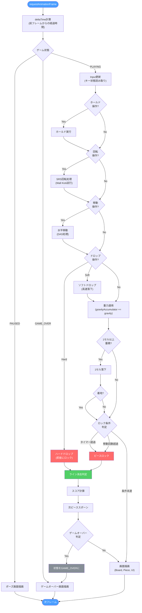
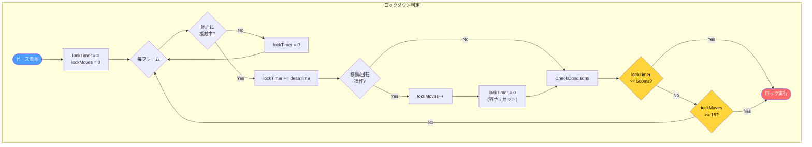

# ゲームメカニクス
{: .no_toc }

ゲームループの処理フロー、重力システム、ロックダウンの仕組みを解説します。
{: .fs-6 .fw-300 }

## 目次
{: .no_toc .text-delta }

1. TOC
{:toc}

---

## ゲームループ

毎フレーム（約60FPS）で実行される処理フローです。



---

## 重力システム

レベルに応じて落下速度が変化します。

### 重力テーブル

| レベル | 重力値 (G) | 落下速度 | 1セル落下時間 |
|-------:|----------:|:---------|:--------------|
| 1 | 0.01667 | 1/60 G | 1.0秒 |
| 2 | 0.021017 | 約1/48 G | 0.79秒 |
| 3 | 0.026977 | 約1/37 G | 0.62秒 |
| 4 | 0.035256 | 約1/28 G | 0.47秒 |
| 5 | 0.04693 | 約1/21 G | 0.36秒 |
| 6 | 0.06361 | 約1/16 G | 0.26秒 |
| 7 | 0.0879 | 約1/11 G | 0.19秒 |
| 8 | 0.1236 | 約1/8 G | 0.13秒 |
| 9 | 0.1775 | 約1/6 G | 0.09秒 |
| 10 | 0.2598 | 約1/4 G | 0.064秒 |
| 11 | 0.388 | 約1/3 G | 0.043秒 |
| 12 | 0.59 | 約1/2 G | 0.028秒 |
| 13 | 0.92 | 約1 G | 0.018秒 |
| 14 | 1.46 | 約1.5 G | 0.011秒 |
| 15+ | 20.0 | 20 G | 即座 |

### 重力計算式

```javascript
// 重力の蓄積
gravityAccumulator += getGravity(level) * deltaTime / 1000;

// 1セル以上蓄積したら落下
while (gravityAccumulator >= 1) {
    gravityAccumulator -= 1;
    if (canMoveDown()) {
        piece.y += 1;
    }
}
```

### レベルアップ条件

```
レベル = floor(消去ライン数 / 10) + 1
```

- 10ライン消去ごとにレベル1アップ
- レベル上限なし（15以上は最高速度固定）

---

## ロックダウンシステム

ピースが着地してからロックされるまでの猶予時間を管理します。



### ロックダウンパラメータ

| パラメータ | 値 | 説明 |
|:-----------|:---|:-----|
| **Lock Delay** | 500ms | 着地後のロック猶予時間 |
| **Max Moves** | 15回 | ロック前の最大移動/回転回数 |
| **リセット条件** | 移動/回転成功時 | タイマーを0にリセット |

### 無限スピン防止

```
移動/回転でタイマーリセット
    ↓
ただし15回を超えると強制ロック
    ↓
無限にT-Spinを続けることを防止
```

---

## 7-bag Randomizer

公平なピース生成アルゴリズムです。

### アルゴリズム

```
1. 7種類のピース [I, O, T, S, Z, J, L] をバッグに入れる
2. Fisher-Yatesアルゴリズムでシャッフル
3. バッグから順番に取り出す
4. バッグが空になったら手順1に戻る
```

### 実装コード概要

```javascript
class TetrominoBag {
    constructor() {
        this.bag = [];
        this.refill();
    }

    next() {
        if (this.bag.length === 0) {
            this.refill();
        }
        return this.bag.pop();
    }

    refill() {
        this.bag = ['I', 'O', 'T', 'S', 'Z', 'J', 'L'];
        this.shuffle();
    }

    shuffle() {
        // Fisher-Yates shuffle
        for (let i = this.bag.length - 1; i > 0; i--) {
            const j = Math.floor(Math.random() * (i + 1));
            [this.bag[i], this.bag[j]] = [this.bag[j], this.bag[i]];
        }
    }
}
```

### 特徴

| 項目 | 説明 |
|:-----|:-----|
| **公平性** | 7手以内に必ず全ピースが1回ずつ出現 |
| **最大間隔** | 同じピースが出るまで最大12手 |
| **予測可能性** | 次の3ピースを表示可能 |

---

## SRS回転システム

Super Rotation System（SRS）はTetris Guidelineの標準回転システムです。

### 回転状態

```
状態 0: スポーン時の向き
状態 1: 時計回りに90度
状態 2: 180度回転
状態 3: 反時計回りに90度（270度）
```

### Wall Kick

壁や他のブロックと衝突した場合、5つのテスト位置を順番に試します。

| テスト | 説明 |
|:-------|:-----|
| Test 1 | 移動なし（基本位置） |
| Test 2 | 横方向にずらす |
| Test 3 | 斜め方向にずらす |
| Test 4 | 大きく横にずらす |
| Test 5 | 斜め反対方向にずらす |

### Wall Kickデータ（JLSTZ）

| 回転 | Test 1 | Test 2 | Test 3 | Test 4 | Test 5 |
|:-----|:-------|:-------|:-------|:-------|:-------|
| 0→1 | (0,0) | (-1,0) | (-1,+1) | (0,-2) | (-1,-2) |
| 1→0 | (0,0) | (+1,0) | (+1,-1) | (0,+2) | (+1,+2) |
| 1→2 | (0,0) | (+1,0) | (+1,-1) | (0,+2) | (+1,+2) |
| 2→1 | (0,0) | (-1,0) | (-1,+1) | (0,-2) | (-1,-2) |
| 2→3 | (0,0) | (+1,0) | (+1,+1) | (0,-2) | (+1,-2) |
| 3→2 | (0,0) | (-1,0) | (-1,-1) | (0,+2) | (-1,+2) |
| 3→0 | (0,0) | (-1,0) | (-1,-1) | (0,+2) | (-1,+2) |
| 0→3 | (0,0) | (+1,0) | (+1,+1) | (0,-2) | (+1,-2) |

---

## 次のページ

- [スコアシステム]({{ site.baseurl }}/scoring) - スコア計算とT-Spin判定
- [操作方法]({{ site.baseurl }}/controls) - キーバインドとDAS設定
