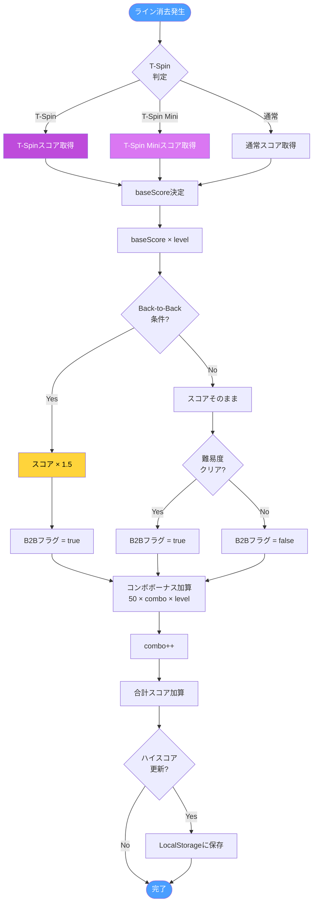
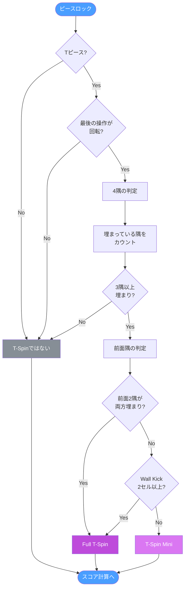

# スコアシステム
{: .no_toc }

スコア計算の仕組み、T-Spin判定ロジック、コンボとBack-to-Backボーナスを解説します。
{: .fs-6 .fw-300 }

## 目次
{: .no_toc .text-delta }

1. TOC
{:toc}

---

## スコア計算フロー

ライン消去時のスコア計算の全体フローです。



---

## 基本スコア表

### ライン消去スコア

| アクション | 基本スコア | Level 1 | Level 5 | Level 10 |
|:-----------|----------:|--------:|--------:|---------:|
| **Single** (1ライン) | 100 | 100 | 500 | 1,000 |
| **Double** (2ライン) | 300 | 300 | 1,500 | 3,000 |
| **Triple** (3ライン) | 500 | 500 | 2,500 | 5,000 |
| **Tetris** (4ライン) | 800 | 800 | 4,000 | 8,000 |

### T-Spinスコア

| アクション | 基本スコア | Level 1 | Level 5 | Level 10 |
|:-----------|----------:|--------:|--------:|---------:|
| **T-Spin** (0ライン) | 400 | 400 | 2,000 | 4,000 |
| **T-Spin Single** | 800 | 800 | 4,000 | 8,000 |
| **T-Spin Double** | 1,200 | 1,200 | 6,000 | 12,000 |
| **T-Spin Triple** | 1,600 | 1,600 | 8,000 | 16,000 |

### T-Spin Miniスコア

| アクション | 基本スコア | Level 1 | Level 5 | Level 10 |
|:-----------|----------:|--------:|--------:|---------:|
| **T-Spin Mini** (0ライン) | 100 | 100 | 500 | 1,000 |
| **T-Spin Mini Single** | 200 | 200 | 1,000 | 2,000 |
| **T-Spin Mini Double** | 400 | 400 | 2,000 | 4,000 |

### ドロップスコア

| アクション | スコア |
|:-----------|-------:|
| **ソフトドロップ** | 1 × 落下セル数 |
| **ハードドロップ** | 2 × 落下セル数 |

---

## T-Spin判定

T-Spinは特定の条件を満たした場合に認定されます。



### 4隅の位置

```
    前面隅
   ┌───┬───┐
   │ A │   │ B │  ← A, B: 前面隅
   ├───┼───┼───┤
   │   │ T │   │  ← T: Tピースの中心
   ├───┼───┼───┤
   │ C │   │ D │  ← C, D: 背面隅
   └───┴───┴───┘
```

### 判定条件

| 条件 | 結果 |
|:-----|:-----|
| 最後の操作が回転でない | T-Spinなし |
| 埋まっている隅が2つ以下 | T-Spinなし |
| 3隅以上埋まり + 前面2隅埋まり | Full T-Spin |
| 3隅以上埋まり + Wall Kick ≥ 2セル | Full T-Spin |
| 3隅以上埋まり + 上記以外 | T-Spin Mini |

---

## コンボシステム

連続でラインを消去するとコンボボーナスが加算されます。

### コンボ計算

```
コンボボーナス = 50 × コンボ数 × レベル
```

### コンボの流れ

| 操作 | コンボ | ボーナス (Level 1) |
|:-----|-------:|------------------:|
| 1回目消去 | 0 | 0 |
| 2回目消去 | 1 | 50 |
| 3回目消去 | 2 | 100 |
| 4回目消去 | 3 | 150 |
| 消去なし | リセット | - |

### コンボ例（Level 5）

```
消去1回目: コンボ0 → ボーナス0
消去2回目: コンボ1 → 50 × 1 × 5 = 250
消去3回目: コンボ2 → 50 × 2 × 5 = 500
消去4回目: コンボ3 → 50 × 3 × 5 = 750
消去5回目: コンボ4 → 50 × 4 × 5 = 1,000
---
合計コンボボーナス: 2,500
```

---

## Back-to-Back

難易度の高いクリア（Tetris、T-Spin）を連続で達成するとボーナスが適用されます。

### B2B条件

| アクション | B2B対象 |
|:-----------|:--------|
| Single (1ライン) | 対象外 |
| Double (2ライン) | 対象外 |
| Triple (3ライン) | 対象外 |
| **Tetris (4ライン)** | **対象** |
| **T-Spin (全種)** | **対象** |
| **T-Spin Mini (全種)** | **対象** |

### B2Bボーナス

```
B2B中のスコア = 基本スコア × レベル × 1.5
```

### B2Bフロー

```
初期状態: B2B = false

[Tetris消去]
  → B2B = true, ボーナスなし

[T-Spin Double]
  → B2B継続, スコア × 1.5

[Single消去]
  → B2B = false (リセット)

[Tetris消去]
  → B2B = true, ボーナスなし (再開始)
```

### B2B計算例

| 順序 | アクション | B2B状態 | 基本 | Level | 倍率 | スコア |
|-----:|:-----------|:--------|-----:|------:|-----:|-------:|
| 1 | Tetris | 開始 | 800 | 5 | 1.0 | 4,000 |
| 2 | T-Spin Double | 継続 | 1,200 | 5 | 1.5 | 9,000 |
| 3 | Tetris | 継続 | 800 | 5 | 1.5 | 6,000 |
| 4 | Double | 終了 | 300 | 5 | 1.0 | 1,500 |
| 5 | Tetris | 開始 | 800 | 5 | 1.0 | 4,000 |

---

## ハイスコア

ハイスコアはブラウザのLocalStorageに保存されます。

### 保存形式

```javascript
// キー
'tetris-highscore'

// 値（数値を文字列として保存）
'12500'
```

### 更新タイミング

1. ゲームオーバー時
2. 現在スコアがハイスコアを超えた場合

### 実装コード概要

```javascript
// ハイスコア取得
getHighScore() {
    return parseInt(localStorage.getItem('tetris-highscore')) || 0;
}

// ハイスコア保存
saveHighScore() {
    if (this.score > this.getHighScore()) {
        localStorage.setItem('tetris-highscore', this.score.toString());
    }
}
```

---

## スコア計算まとめ

### 最終スコア計算式

```
最終スコア = (基本スコア × レベル × B2B倍率) + コンボボーナス + ドロップボーナス
```

### 各要素

| 要素 | 計算 |
|:-----|:-----|
| 基本スコア | ライン数とT-Spinで決定 |
| レベル倍率 | 消去ライン数 ÷ 10 + 1 |
| B2B倍率 | 1.0 または 1.5 |
| コンボボーナス | 50 × コンボ × レベル |
| ソフトドロップ | 1 × 落下セル |
| ハードドロップ | 2 × 落下セル |

---

## 次のページ

- [操作方法]({{ site.baseurl }}/controls) - キーバインドとDAS設定
- [アーキテクチャ]({{ site.baseurl }}/architecture) - モジュール構成とクラス設計
